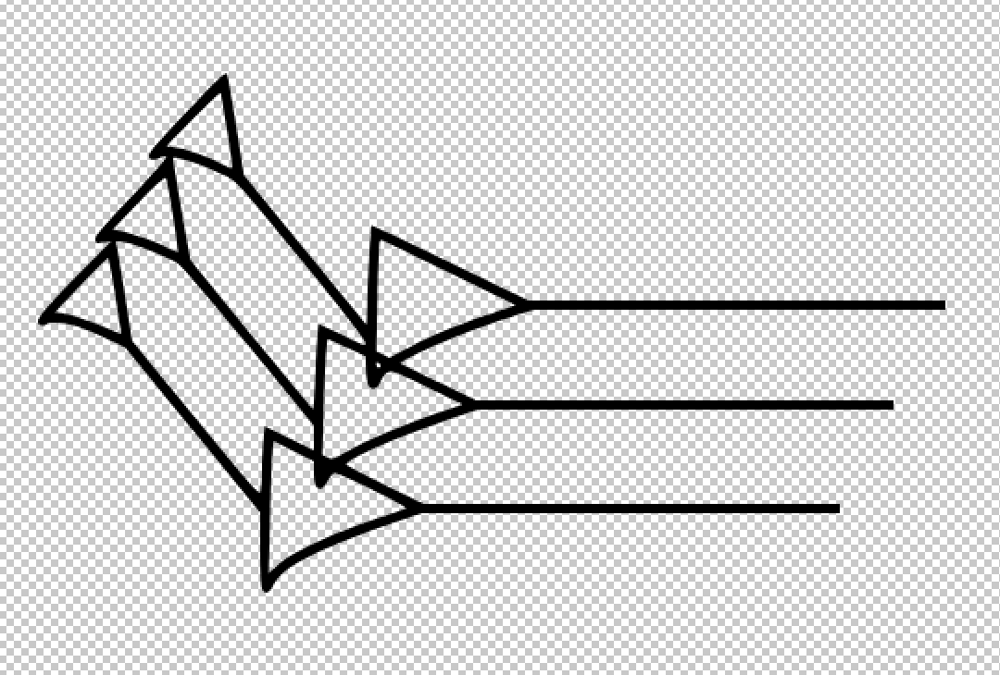

# cuneiform-convert
To run this repository, first install imagemagick and [potrace](https://potrace.sourceforge.net/). Images are originally from [this](https://github.com/oaregithub/OAsigns) repository. 
# Usage
Simply run `script.py` after installing the needed dependencies: imgmagick, potrace (CLI utilities), SPARQLWrapper, PIL, and BeautifulSoup (Python libraries). This code no longer requires or uses Autotrace.
# Caveats
The script will generate a lot of intermediate files (notably PNM files, because potrace does not use PNGs) in `misc_files/`, which can be deleted after conversion is complete. However, I recommend not deleting them, as this can help to speed up future conversion tasks.
# Transparency
The script is written such that the images will have no transparency, within or outside of the Cuneiform sign. When opened in Photoshop or GIMP the image will look like this:

